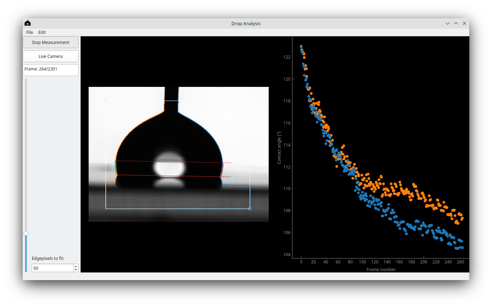

Drop analysis 
-----------------------------------

The `drop-analysis` program can analyse sessile drops and measure their contact angles, contact line position and center of mass from 2D images. 

The software is free to use and released under the GPLv3 license.

The software can directly read out a (supported) camera, or open images, tiffstacks, and video files.
This allows the measurement of dynamics of drops in the image plane.

These images are typically made with a contact angle goniometer, though building a setup capable of making these images is not hard.

Features
~~~~~~~~~~~~~~~~~~~~~~

* Contact angle measurement
   - Using polyfit (configurable order)
   - Using ellipse fit
* Contact line position measurement
   - With sub-pixel accuracy
* Sub-pixel accurate drop-edge detection
   - Based on linear interpolation (fast)
   - Based on error function fitting (accurate, robust, cpu-heavy)
* Center of mass measurement
   - For drops that are symmetric out-of-plane
* Volume measurement
   - For drops that are symmetric out-of-plane
 
Screenshot
~~~~~~~~~~~~~~~~~~~~~~ 

.. toctree::
   :maxdepth: 2
   :caption: Contents:
   
   install.md
   usage.md
   contact.md
